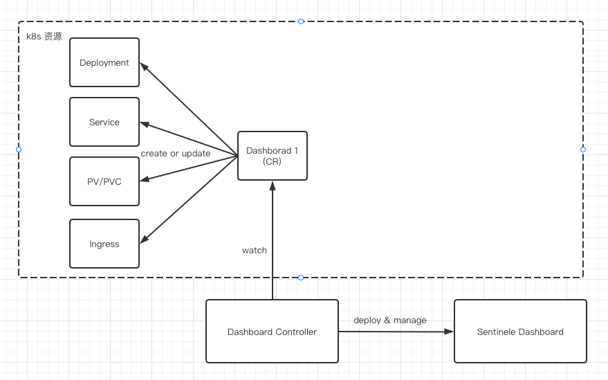

# Kubernetes operator for Sentinel dashboard

[](https://www.apache.org/licenses/LICENSE-2.0.html)

Sentinel Dashboard 支持通过 kubernetes CRD 的方式原生部署。

## Description



我们希望提交给 kubernetes 一份 Dashboard 资源，kubernetes 帮我们自动生成相应的deployment和service, 生产级场景，可能还要生成ingress，pv，pvc等，而不用再手动去写相应的kubernetes原生多个资源。Dashboard CRD 格式当前设计运行后如下：

```yaml
apiVersion: sentinel.sentinelguard.io/v1alpha1
kind: Dashboard
metadata:
  annotations:
  creationTimestamp: "2022-11-23T03:56:00Z"
  generation: 6
  name: sentinel-dashboard
  namespace: sentinel-group
  resourceVersion: "148637400"
  uid: ec117635-dbd0-4953-81fe-e95f7a4c93d8
spec:
  env:
  - name: NACOS_ADDRESS
    value: nacos.nacos-group:8848
  image: sentinel-group/sentinel-dashboard:v0.1.0
  ports:
  - port: 8080
    protocol: TCP
  replicas: 1
  resources:
    limits:
      cpu: 1
      memory: 1Gi
    requests:
      cpu: 1
      memory: 2Gi
  type: NodePort
status:
  conditions:
  - lastTransitionTime: "2022-11-23T10:14:06Z"
    message: ""
    observedGeneration: 6
    reason: ""
    status: "True"
    type: Ready
  - lastTransitionTime: "2022-11-24T08:37:32Z"
    message: 'Deployment.apps "sentinel-dashboard" is invalid: spec.template.spec.containers[0].resources.requests:
      Invalid value: "2Gi": must be less than or equal to memory limit'
    observedGeneration: 6
    reason: MutateDeployment
    status: "False"
    type: Applied
```


## How it works

This project aims to follow the Kubernetes [Operator pattern](https://kubernetes.io/docs/concepts/extend-kubernetes/operator/).

It uses [Controllers](https://kubernetes.io/docs/concepts/architecture/controller/)  which provides a reconcile function responsible for synchronizing resources untile the desired state is reached on the cluster.

## Getting Started

You’ll need a Kubernetes cluster to run against. You can use [KIND](https://sigs.k8s.io/kind) to get a local cluster for testing, or run against a remote cluster.
**Note:** Your controller will automatically use the current context in your kubeconfig file (i.e. whatever cluster `kubectl cluster-info` shows).

### Running on the local

1. Install the CRDs into the cluster:

```sh
make install
```

2. Run your controller (this will run in the foreground, so switch to a new terminal if you want to leave it running):

```sh
make run
```

**NOTE:** You can also run this in one step by running: `make install run`

### Running on the cluster

1. Install Instances of Custom Resources:

```sh
kubectl apply -f config/samples/
```

2. Build and push your image to the location specified by `IMG`:

```sh
make docker-build docker-push IMG=<some-registry>/sentinel-dashboard-k8s-operator:tag
```

3. Deploy the controller to the cluster with the image specified by `IMG`:

```sh
make deploy IMG=<some-registry>/sentinel-dashboard-k8s-operator:tag
```

### Modifying the API definitions

If you are editing the API definitions, generate the manifests such as CRs or CRDs using:

```sh
make manifests
```

**NOTE:** Run `make --help` for more information on all potential `make` targets

### Uninstall CRDs

To delete the CRDs from the cluster:

```sh
make uninstall
```

### Undeploy controller

UnDeploy the controller to the cluster:

```sh
make undeploy
```
